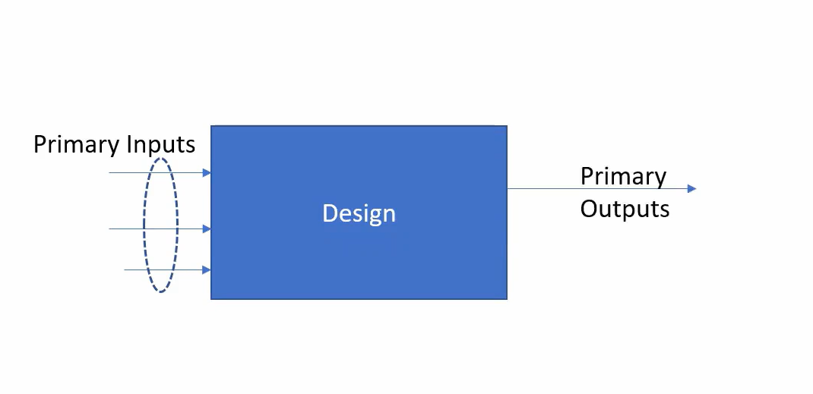

# 🌟 Introduction to Open-Source Simulator: Icarus Verilog (iverilog)
## Introduction to Iverilog,Design and Test Bench
**Simulator**
Simulator is the tool used for simulating the design.

**Design**
Design is the actual verilog code or set of verilog codes which has the intended functionality to meet the required specifications.

**TestBench**
TestBench is the setup to apply stimulus(test_vectors)to  the design to check its functionality.

*How the simulator works:*  
Simulator looks for the changes in the input signals.   
Upon every change in the input the output will be evaluated.    
  
